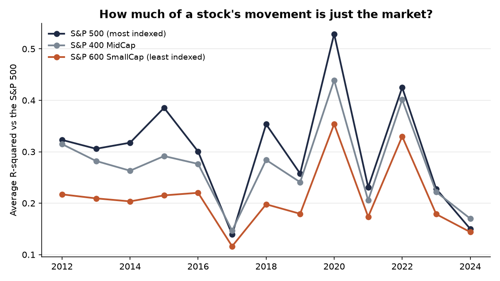
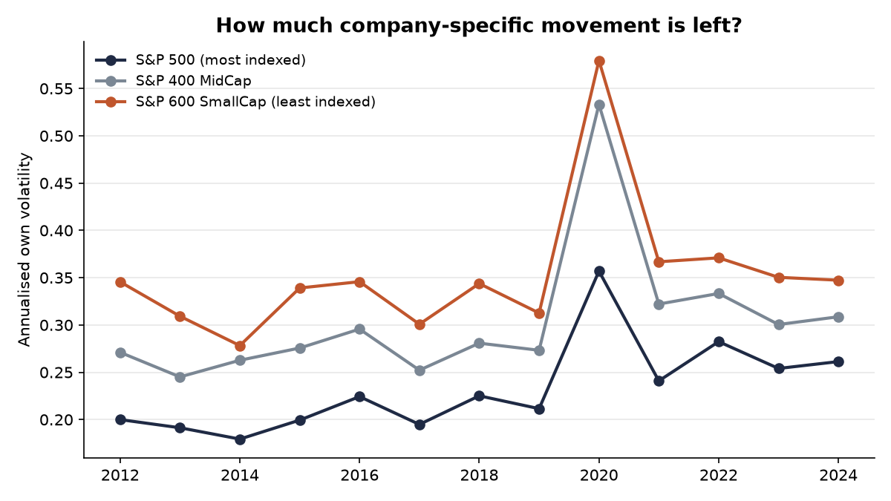
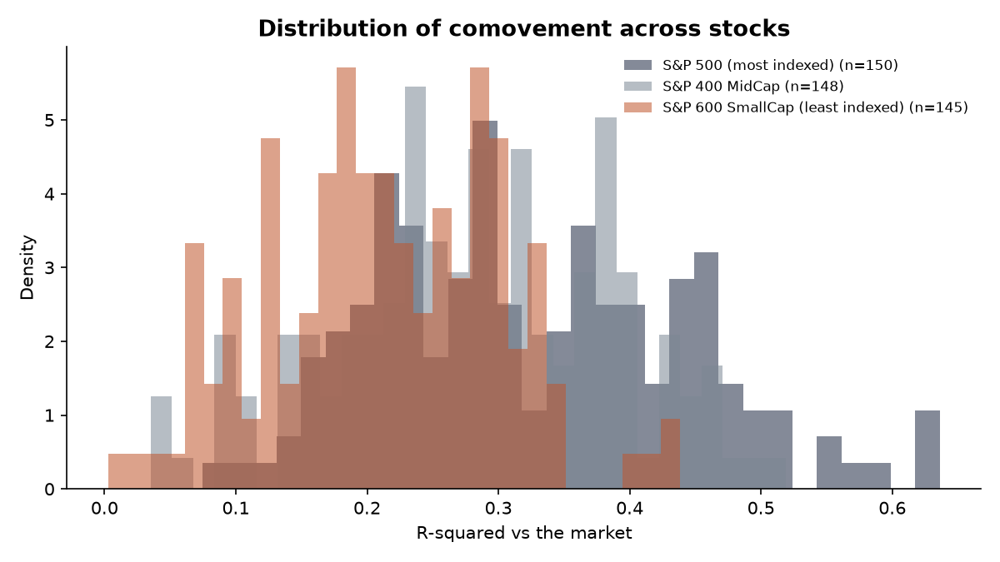
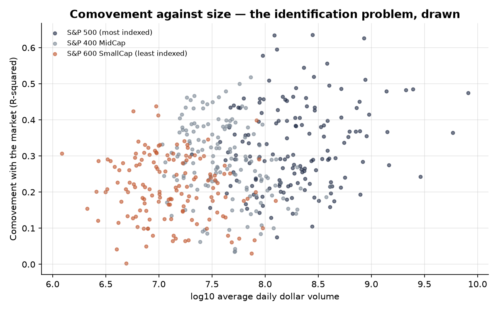
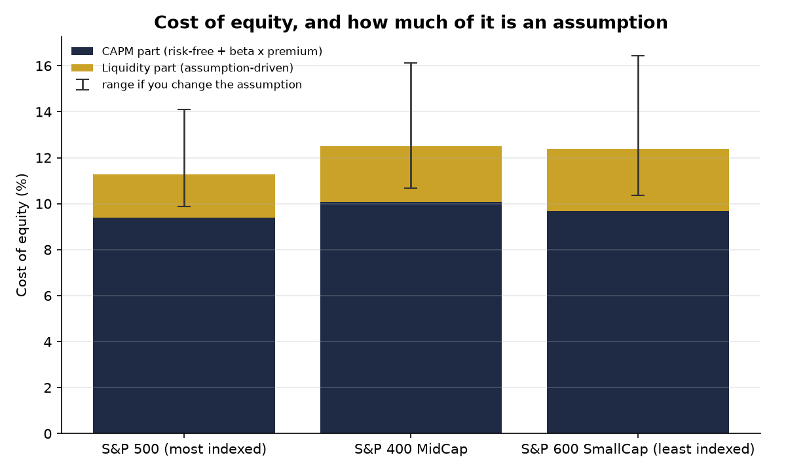

# Passive investing and price discovery

Index funds and ETFs went from roughly 19% of US long-term fund assets in 2010 to over
50% in 2024 (ICI / Morningstar). An index fund buys every stock in its index in proportion
to size, without forming any view about whether a particular company is any good.

This project asks what that does to prices, and whether it reaches the cost of capital.

**Sample:** 443 US stocks drawn from the actual constituent lists of the S&P 500,
S&P 400 MidCap and S&P 600 SmallCap — three indices that differ in how much passive money
mechanically has to own them. Period 2012-01-01 to 2025-01-01, benchmark
SPY. That is 5,128 stock-year observations.

---

## How price discovery is measured

Everything comes from one regression, run for each stock and each year:

```
stock return  =  a  +  b × market return  +  error
```

| Measure | What it is | How to read it |
|---|---|---|
| **Beta** | the `b` | how much the stock moves when the market moves |
| **Comovement (R²)** | fit of the regression | close to 1: the stock is basically the index. Close to 0: it moves on its own news |
| **Own volatility** | size of the `error`, annualised | the company-specific movement left over |
| **Reaction delay** | extra fit from adding *yesterday's* market returns | 0 means it reacts immediately; higher means it reacts late |
| **Trading range** | average daily (high − low) / close | rough proxy for what it costs to trade |

---

## 1. The raw picture

| tier   |   firms |   beta |   comovement |   own_volatility |   reaction_delay |   trading_cost_pct |
|:-------|--------:|-------:|-------------:|-----------------:|-----------------:|-------------------:|
| sp500  |     150 |  1.04  |        0.327 |            0.258 |            0.009 |              2.346 |
| sp400  |     148 |  1.176 |        0.283 |            0.343 |            0.012 |              3.016 |
| sp600  |     145 |  1.097 |        0.212 |            0.397 |            0.019 |              3.377 |





Average comovement, first three years versus last three years:

| tier   |   first 3 years |   last 3 years |   change |
|:-------|----------------:|---------------:|---------:|
| sp400  |           0.286 |          0.263 |   -0.023 |
| sp500  |           0.315 |          0.268 |   -0.047 |
| sp600  |           0.21  |          0.217 |    0.007 |



The histograms matter as much as the averages. If the distributions overlap heavily, a
difference in means is a weaker statement than it looks.

---

## 2. But is it just size?

This is the obvious objection, and it deserves a real answer rather than a footnote.
S&P 500 companies are larger, and larger companies differ in analyst coverage, liquidity
and institutional ownership — all of which could produce the same pattern with no help from
index funds.



The chart shows the problem directly: the tiers sit at different points on one continuous
size gradient.

So instead of comparing averages, the project runs a regression:

```
comovement = a + b × (in the S&P 500) + c × log(size) + year effects
```

and reports the coefficient `b` — the difference that survives once size is accounted for.
Standard errors are **clustered by firm**, because the same company appears once per year
and its errors are correlated across years. Ordinary standard errors would be far too small
here and would make almost everything look significant.

The last row uses a **matched sample**: the 60 smallest companies
in the S&P 500 against the 60 largest in the S&P 400. Similar in
size, opposite sides of the line that determines how much index money has to own them.

| sample                                   | size_control   | year_effects   |   sp500_coefficient |   standard_error |   t_statistic | significance   |   observations |   firms |
|:-----------------------------------------|:---------------|:---------------|--------------------:|-----------------:|--------------:|:---------------|---------------:|--------:|
| all stocks                               | no             | no             |              0.0615 |           0.0103 |          5.96 | ***            |           5128 |     443 |
| all stocks                               | yes            | no             |              0.0247 |           0.0117 |          2.1  | **             |           5128 |     443 |
| all stocks                               | yes            | yes            |              0.0117 |           0.0122 |          0.95 | nan            |           5128 |     443 |
| matched (S&P 500 small vs S&P 400 large) | yes            | yes            |              0.0336 |           0.0189 |          1.77 | *              |           1355 |     120 |

`*** |t| > 2.58, ** |t| > 1.96, * |t| > 1.65`

Full results for all three dependent variables are in `output/regression_results.csv`.

---

## 3. Does it reach the cost of capital?

The cost of equity is built in two pieces:

```
cost of equity  =  risk-free rate + beta × market premium      (CAPM)
                 + k × trading cost                            (liquidity premium)
```

Assumptions, all set in `config.py`:

- risk-free rate **4.2%**
- market risk premium **5.0%**
- liquidity coefficient k **80 bp** per 1% of trading cost
  (low 20, high 200)



| tier   |   capm_pct |   trading_cost_pct |   liquidity_premium_low_bp |   liquidity_premium_bp |   liquidity_premium_high_bp |   total_cost_of_equity_pct |
|:-------|-----------:|-------------------:|---------------------------:|-----------------------:|----------------------------:|---------------------------:|
| sp400  |      10.08 |               3.02 |                      60.3  |                 241.24 |                      603.22 |                      12.49 |
| sp500  |       9.4  |               2.35 |                      46.98 |                 187.71 |                      469.24 |                      11.28 |
| sp600  |       9.69 |               3.38 |                      67.54 |                 270.13 |                      675.28 |                      12.39 |

### The honest conclusion

The black bars show what happens to the liquidity component when the assumption `k` moves
from its low case to its high case. That range is wider than the gap between the index
tiers. In other words, **the uncertainty in the assumption is larger than the difference in
the data**.

That is the reason nobody can honestly quote a precise figure for how much index investing
has raised the cost of capital. What this project can show is that a difference exists, how
much of it survives controls, and roughly how big the cost-of-capital consequence might be
under stated assumptions.

---

## What this does not show

- **It is not a causal estimate.** Controlling for size and year effects narrows the gap
  between explanations; it does not close it. Index membership is not randomly assigned, and
  the matched sample is a partial fix, not an experiment.
- **Size is proxied by average dollar volume**, not market capitalisation, because market
  cap requires a per-company data request. The proxy is highly correlated with size but is
  not the same thing.
- **Comovement is a blunt measure.** A high R² can mean the price carries little
  company-specific information, or simply that the company genuinely has market-like
  earnings. A regulated utility and a biotech should not have the same R² for reasons that
  have nothing to do with index funds.
- **The trading range is a proxy for the bid-ask spread**, not the spread itself. Real
  spreads need intraday data.
- **Survivorship.** The constituent lists are today's, applied backwards, so companies that
  dropped out of an index are missing.

## What would make it stronger

1. Actual index-ownership percentages per company, instead of index membership as a proxy.
2. Point-in-time constituent lists, which removes the survivorship problem.
3. Market capitalisation as the size control instead of dollar volume.
4. A within-company design: track the same firm as its index membership changes, which
   removes everything that is fixed about the company.
